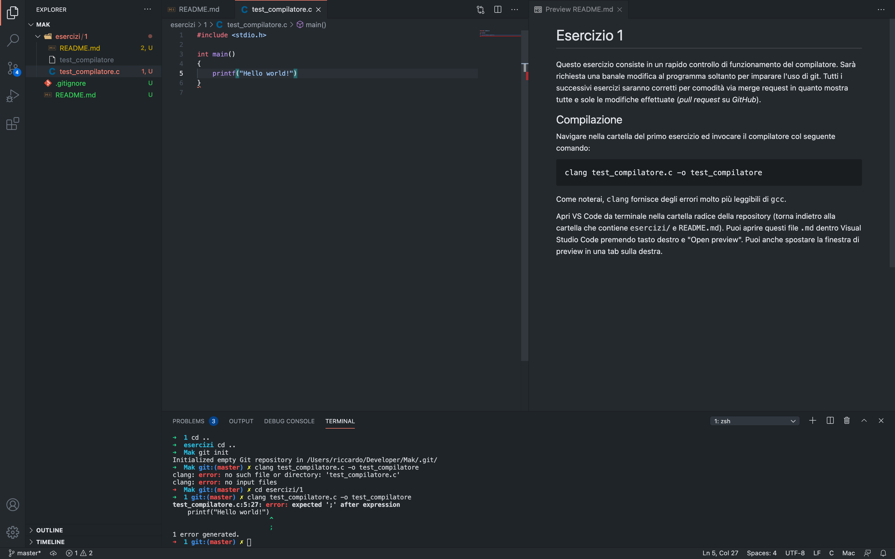

# 1. Esercizio 1

Questo esercizio consiste in un rapido controllo di funzionamento del compilatore. Sarà richiesta una banale modifica al programma soltanto per imparare l'uso di git. Tutti i successivi esercizi saranno corretti per comodità via merge request in quanto mostra tutte e sole le modifiche effettuate (*pull request* su *GitHub*).

## 1.1. Compilazione

Navigare nella cartella del primo esercizio ed invocare il compilatore col seguente comando:

```zsh
clang test_compilatore.c -o test_compilatore
```

Come noterai, `clang` fornisce degli errori molto più leggibili di `gcc`.

Apri VS Code da terminale nella cartella radice della repository (torna indietro alla cartella che contiene `esercizi/` e `README.md`). Puoi aprire questi file `.md` dentro Visual Studio Code premendo tasto destro e "Open preview". Puoi anche spostare la finestra di preview in una tab sulla destra.



Correggi l'errore, apri un terminale integrato (Terminal > New Terminal) e prova a compilare nuovamente. Esegui il file prodotto e controlla che funzioni.

## 1.2. Invio del programma corretto

Come noterai, i file nella barra di sinistra hanno vari colori (rosso e giallo per errori, verde in caso di modifiche). Occorre inviare tutte le modifiche al server di *GitLab*.

Aspetta, io non uso Linux, cosa me ne faccio del tuo eseguibile? Come vedi è grigio, e questo è dovuto al [file di configurazione `.gitignore`](../../.gitignore) (i file che iniziano per '.' sono nascosti su sistemi Linux e Darwin, ma visibili in Code). `git` ora sa di ignorare questo tipo di file. Puoi quindi tranquillamente inviare tutto, senza preoccuparti dei file oggetto o eseguibili (che è sbagliato includere in `git`).

Dal terminale, da dentro una delle cartelle della repo, indipendentemente da quale, scrivi:

```zsh
git status
```

### 1.2.1. Staging dei file

Apparirà un elenco di file modificati. Dovresti avere soltanto il file `test_compilatore.c`.

Ora dobbiamo dire a `git` che la prossima modifica includerà tutti i file elencati.

```zsh
git add .
```

È bene fare attenzione ad includere tutta la repo. Se siamo a due cartelle di profondità, specificare `.` come cartella di inclusione includerà solo le modifiche in questa cartella, quindi si dovrà usare `../..` per considerare i due livelli superiori. Controllare con un nuovo `git status` che non ci siano "Untracked files" ma solo "Changes to be committed".

Quando si è soddisfatti del numero di file inclusi (spesso se si hanno molti file modificati si opera in più parti correlate tra loro), è ora di effettuare un commit, ovvero di registrare un istantanea dello stato corrente della repository.

Verranno registrati soltanti i file aggiunti in questo passaggio, chiamato "staging".

### 1.2.2. Commit

Per registrare un'istantanea, usare il seguente comando:

```zsh
git commit -m "<MESSAGGIO>"
```

Un buon messaggio per questo commit può essere "Fixed missing semicolon." (notare il punto, la maiuscola e la lunghezza non eccessiva del messaggio). Non serve raccontare molto, in quanto tutte le modifiche sono facilmente visibili.

### 1.2.3. Altre modifiche

Per vedere cos'è cambiato tra l'ultima e la penultima istantanea, usare `git show`.

Per vedere cos'è cambiato tra i file attuali non "fotografati" e l'ultima istantanea, usare `git diff`.

> **Nota**: Per uscire da questi comandi, premere `q`.

`git diff` non dovrebbe mostrare modifiche.

Cambia il messaggio stampato dalla `printf()` in qualcosa di non scandaloso. Effettua un altro commit e controlla che la modifica sia stata fatta con `git show`. Passa al prossimo passo, hah.

### 1.2.4. Invio al server

È ora di inviare due commit al server. I server hanno un nome, e il nome del primo server, se non cambiato, è `origin`.

Eseguire il seguente comando per inviare al server `origin` (quello da cui hai clonato, che dovrebbe essere a tuo nome, non mio, altrimenti non funzionerà a causa di un accesso negato) il ramo di sviluppo `master`, che per ora fai finta di sapere cosa sia e annuisci vistosamente. Useremo solo `master` per un po, troppa carne al fuoco se no.

```zsh
git push origin master
```

## 1.3. Proposta di cambiamento al proprietario

È ora di effettuare una *merge request* per chiedere al proprietario della repository di revisionare le modifiche ed eventualmente accettarle. Vai su *GitLab* dal tuo browser ed avvia una nuova *merge request* dal tuo ramo `master` al mio ramo `master`. Non è difficile, prova a vedere se riesci da solo e fai solo attenzione a selezionare il giusto mittente e destinatario (non scambiarli). Inserisci un commento se necessario.

## 1.4. Ricevere aggiornamenti

Quando pubblicherò aggiornamenti a questa repository, non saranno automaticamente passati al tuo fork. Devi dunque aggiungere il mio server, clonare i cambiamenti dal mio server e caricarli sul tuo. Come si fa?

### 1.4.1. Aggiungere un server

```zsh
git remote add <nome server> <url server>
```

Normalmente, al server della copia "originale" si dà il nome `upstream`. L'url del server lo devi copiare dalla mia repository, selezionando "Clone" e copiando il link SSH.

Controlla di avere aggiunto il server scrivendo `git remote`. Dovresti avere `origin` ed `upstream`.

Ora occorre fare l'azione opposta al `push`... `pull`.

### 1.4.2. Pull

```zsh
git pull <nome server> <nome ramo>
```

Abbiamo detto che useremo sempre il ramo `master`. Da che server devi scaricare i dati? Da `upstream`.

Una volta scaricati, ti conviene immediatamente aggiornare il tuo server [facendo un `push`](#invio-al-server) verso `origin`.

Questo è quanto, forse vedremo il concetto di rami ma per ora non serve.

```zsh
# Fondamentali:
git clone   # Clona una repository (ricezione iniziale)
git add     # Staging delle modifiche
git commit  # Istantanea delle modifiche in staging
git push    # Invio al server
git pull    # Ricezione dal server

# Utili:
git status  # Stato attuale della repo locale
git diff    # Differenza tra i file che vedi rispetto all'ultima istantanea
git show    # Differenza tra le ultime due istantanee
git remote  # Gestisci i server
```

Controlla gli aggiornamenti di questo file e dell'indice iniziale per altri esercizi.
